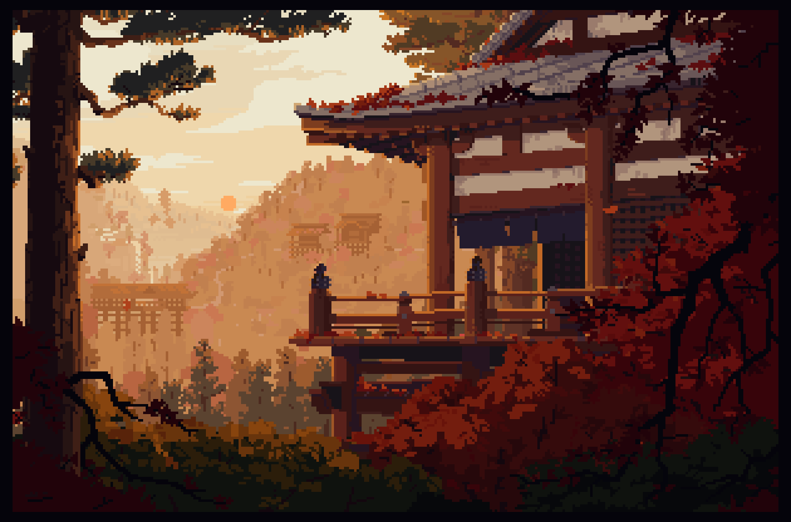
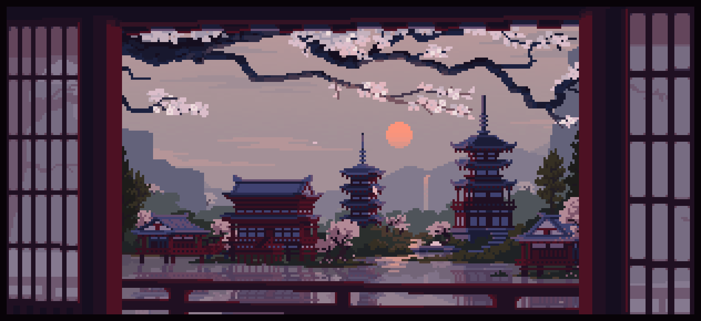

  

  <h1>
    <code> > NEXUS | TEAM ⛩️ </code>
  </h1>

 

<table>
  <tr>
    <td width="50%" valign="top">
      
### Sobre Mi:

Hola, me llamo **edux_gx**. soy un creador de código / vive coding, me gusta el desarrollo tanto para apps/páginas o ect

y disfruto del desarrollo de complementos para pocketmine api 2.0.0
    </td>    
    <td width="50%" valign="top">
      
### Mis Intereses:

`1) Desarrollo de Apps`
`2) Pocketmine 7.0.2` `3) desarrollo wep`  
`4) La buena estética` `5) Las android apps` `6) Development`  
`7) Escuchar musica` `8) Minecraft 0.15.10`
    </td>
  </tr>
</table>

 

### 💻 | Mis lenguajes Favoritos:

  

  

 

### 🪷 | Comunícate Conmigo:

  
  &nbsp;
  
  &nbsp;
  

 

---
